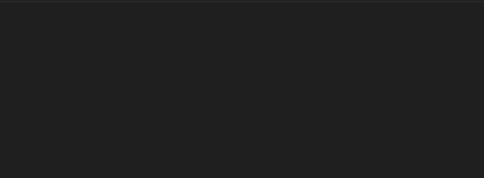

in this seciond i made Task1, and 2,4 
you will see in the end a lot of outputs as needed in those tasks. 

for creating the LB, we also needed to do 2 subnets, so i created addition public subnet, 
then we need to create Auto Scalling group with template,
and then we need to do the "Forwarding by the port" like we did in the UI
i added a screen shot if you dont want to run this program. 

btw it was very chanllging and fun!

